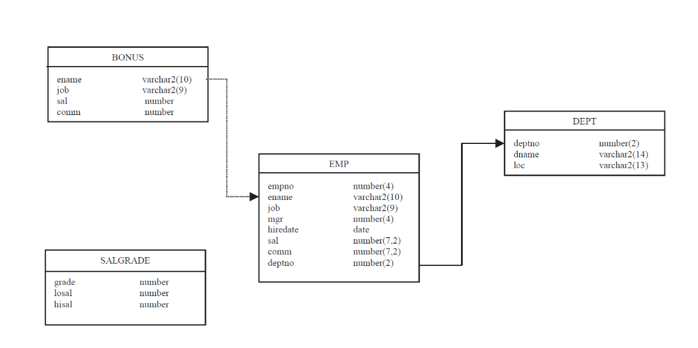

## prerequisite

* * *
1. 버추얼박스 다운로드  
    1-1 구글 버추얼박스 검색  
    https://www.virtualbox.org/wiki/Downloads  
    1-2  
        windows hosts 클릭 다운로드  ~~~~
  
2. VirtualBox-xxxxxxxxxx.exe 실행  
    next 해서 설치!!!  

3. Vagrant 다운로드  
    1-1 구글 Vagrant 검색  
    https://www.vagrantup.com/  

    1-2 Amd64 686 중 1개 다운로드  
        본인 PC 정보 -> 윈도우키 누르고 PC 정보 검색하면된다.  
        CPU intel 이면 686  
            AMD 이면 Amd64  

4. Vagrant 설치  
    next 해서 설치!  
    재시작  

5. cmder 다운로드  
    5-1  
        구글 cmder 검색  
        https://cmder.app/  
        접속  
        download full 클릭 다운로드  
    5.2 압축풀기  
        반디집 기준 우클릭 알아서풀기  

6. Cmder.exe 실행  
    unblock continue 클릭  

7. vagrant 서버 폴더 만들기  
    c:\Python작업폴더\vagrant\server1 <- 탐색기 우클릭 새폴더 만들어도된다.  
  
    [[ cmder 로 폴더만들기 ]]  
    cd  c:\Python작업폴더\  
    mkdir vagrant  
    cd vagrant    
    mkdir server1  
    cd server1  

8. vagrant cloud 접속  (Vagrantfile 이 존재한다면 생략)
    받고싶은 이미지 클릭 또는 검색  
    new 탭  
    vagrant init 이미지명  <- Vagrantfile 생성
9. vagrant up  <- Vagrantfile 작성된 기준으로 이미지 다운로드 및 설치  
  
9. vagrant 리눅스 접속  
    vagrant ssh  

10. 하이디SQL 설치
    https://www.heidisql.com/  

 * * *

### MySQL 예제 스키마



```
SET SQL_MODE="NO_AUTO_VALUE_ON_ZERO";


/*!40101 SET @OLD_CHARACTER_SET_CLIENT=@@CHARACTER_SET_CLIENT */;
/*!40101 SET @OLD_CHARACTER_SET_RESULTS=@@CHARACTER_SET_RESULTS */;
/*!40101 SET @OLD_COLLATION_CONNECTION=@@COLLATION_CONNECTION */;
/*!40101 SET NAMES utf8 */;

--
-- 데이터베이스: `scott`
--

-- --------------------------------------------------------

--
-- 테이블 구조 `bonus`
--

CREATE TABLE IF NOT EXISTS `bonus` (
  `ENAME` varchar(10) DEFAULT NULL,
  `JOB` varchar(9) DEFAULT NULL,
  `SAL` double DEFAULT NULL,
  `COMM` double DEFAULT NULL
) ENGINE=InnoDB DEFAULT CHARSET=utf8;

--
-- 테이블의 덤프 데이터 `bonus`
--


-- --------------------------------------------------------

--
-- 테이블 구조 `dept`
--

CREATE TABLE IF NOT EXISTS `dept` (
  `DEPTNO` int(11) NOT NULL,
  `DNAME` varchar(14) DEFAULT NULL,
  `LOC` varchar(13) DEFAULT NULL,
  PRIMARY KEY (`DEPTNO`)
) ENGINE=InnoDB DEFAULT CHARSET=utf8;

--
-- 테이블의 덤프 데이터 `dept`
--

INSERT INTO `dept` (`DEPTNO`, `DNAME`, `LOC`) VALUES
(10, 'ACCOUNTING', 'NEW YORK'),
(20, 'RESEARCH', 'DALLAS'),
(30, 'SALES', 'CHICAGO'),
(40, 'OPERATIONS', 'BOSTON');

-- --------------------------------------------------------

--
-- 테이블 구조 `emp`
--

CREATE TABLE IF NOT EXISTS `emp` (
  `EMPNO` int(11) NOT NULL,
  `ENAME` varchar(10) DEFAULT NULL,
  `JOB` varchar(9) DEFAULT NULL,
  `MGR` int(11) DEFAULT NULL,
  `HIREDATE` datetime DEFAULT NULL,
  `SAL` double DEFAULT NULL,
  `COMM` double DEFAULT NULL,
  `DEPTNO` int(11) DEFAULT NULL,
  PRIMARY KEY (`EMPNO`),
  KEY `PK_EMP` (`DEPTNO`)
) ENGINE=InnoDB DEFAULT CHARSET=utf8;

--
-- 테이블의 덤프 데이터 `emp`
--

INSERT INTO `emp` (`EMPNO`, `ENAME`, `JOB`, `MGR`, `HIREDATE`, `SAL`, `COMM`, `DEPTNO`) VALUES
(7369, 'SMITH', 'CLERK', 7902, '1980-12-17 00:00:00', 800, NULL, 20),
(7499, 'ALLEN', 'SALESMAN', 7698, '1981-02-20 00:00:00', 1600, 300, 30),
(7521, 'WARD', 'SALESMAN', 7698, '1981-02-22 00:00:00', 1250, 500, 30),
(7566, 'JONES', 'MANAGER', 7839, '1981-04-02 00:00:00', 2975, NULL, 20),
(7654, 'MARTIN', 'SALESMAN', 7698, '1981-09-28 00:00:00', 1250, 1400, 30),
(7698, 'BLAKE', 'MANAGER', 7839, '1981-05-01 00:00:00', 2850, NULL, 30),
(7782, 'CLARK', 'MANAGER', 7839, '1981-06-09 00:00:00', 2450, NULL, 10),
(7788, 'SCOTT', 'ANALYST', 7566, '1987-04-19 00:00:00', 3000, NULL, 20),
(7839, 'KING', 'PRESIDENT', NULL, '1981-11-17 00:00:00', 5000, NULL, 10),
(7844, 'TURNER', 'SALESMAN', 7698, '1981-09-08 00:00:00', 1500, 0, 30),
(7876, 'ADAMS', 'CLERK', 7788, '1987-05-23 00:00:00', 1100, NULL, 20),
(7900, 'JAMES', 'CLERK', 7698, '1981-12-03 00:00:00', 950, NULL, 30),
(7902, 'FORD', 'ANALYST', 7566, '1981-12-03 00:00:00', 3000, NULL, 20),
(7934, 'MILLER', 'CLERK', 7782, '1982-01-23 00:00:00', 1300, NULL, 10);

-- --------------------------------------------------------

--
-- 테이블 구조 `salgrade`
--

CREATE TABLE IF NOT EXISTS `salgrade` (
  `GRADE` double DEFAULT NULL,
  `LOSAL` double DEFAULT NULL,
  `HISAL` double DEFAULT NULL
) ENGINE=InnoDB DEFAULT CHARSET=utf8;

--
-- 테이블의 덤프 데이터 `salgrade`
--

INSERT INTO `salgrade` (`GRADE`, `LOSAL`, `HISAL`) VALUES
(1, 700, 1200),
(2, 1201, 1400),
(3, 1401, 2000),
(4, 2001, 3000),
(5, 3001, 9999);

--
-- Constraints for dumped tables
--

--
-- Constraints for table `emp`
--
ALTER TABLE `emp`
  ADD CONSTRAINT `PK_EMP` 
  FOREIGN KEY (`DEPTNO`) REFERENCES `dept` (`DEPTNO`) ON DELETE SET NULL ON UPDATE CASCADE;

```


